Many sections of the present lesson have been taken from the online [Copernicus Training material](https://uls.climate.copernicus.eu/).

[Copernicus](https://www.copernicus.eu/en), previously known as GMES (Global Monitoring for Environment and Security), is the European Programme for the establishment of a European capacity for Earth Observation. 
# What is climate?

Everybody has an opinion about climate or climate change ,but do we all have the same understanding on what the word climate means?

> ## What does the word climate mean to you?
> Go to [www.menti.com](https://www.menti.com/) and give us a list of words that you associate with climate. Use the code given by your instructor to enter the corresponding *menti* room.
> 
> Let's have a short discussion alltogether about the words that appear most. Is it surprising?
>
{: .challenge}

According to [wikipedia](https://en.wikipedia.org/wiki/Climate), 
Climate is defined as the average state of everyday's weather condition over a period of 30 years. It is measured by assessing the patterns of variation in temperature, humidity, atmospheric pressure, wind, precipitation, atmospheric particle count and other meteorological variables in a given region over long periods of time.
Climate differs from weather, in that weather only describes the short-term conditions of these variables in a given region. 

> ## What do you think about wikipedia's definition of climate?
>
> Take a few minutes to talk in small groups (2 to 3 people) about the definition of climate
> as given by wikipedia.
>
{: .challenge}

# Climate versus Weather

Quantities that climate scientists are interested in are similar to those used to assess the weather. But there is a big difference between climate and weather: **weather** varies from hour to hour and from day to day whereas **climate** is defined as the average of weather over several decades or longer.

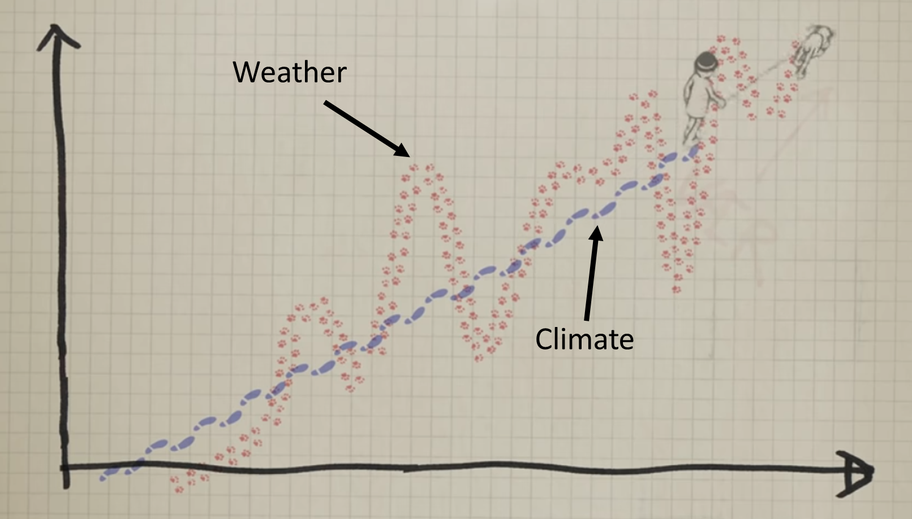

*Source: [Animated short on statistics](https://youtu.be/e0vj-0imOLw) from Norwegian infotainment program Siffer. Produced by TeddyTV for NRK. Animation by Ole Christoffer Haga*

Watch this [Video](https://youtu.be/e0vj-0imOLw) to get an illustration of the difference between climate and weather.

Climate questions are different from weather questions:
- Will it rain tomowrow?                  *<- weather*
- By how much will global temperature at the end of the century be warmer than the beginning of the century?                 *<- climate*
- What could happen if CO2 emissions double within the next century?                 *<- climate*

# Climate variables

*Temperature* is often the first variable that comes to mind when we talk about climate. However, it is insufficient to fully characterize the climate, and scientists have agreed on a number of variables to systematically observe Earth`s changing climate. 

That is what we call *Essential Climate Variables*.

## Essential Climate Variables

The [Global Climate Observing System](https://gcos.wmo.int/) (GCOS) and its GCOS expert panels maintain definitions of [Essential Climate Variables](https://gcos.wmo.int/en/essential-climate-variables) (ECVs). 

GCOS is co-sponsored by the [World Meteorological Organization](https://public.wmo.int/en) (WMO), the [Intergovernmental Oceanographic Commission of the United Nations Educational, Scientific and Cultural Organization](http://www.ioc-unesco.org/) (IOC-UNESCO), the [United Nations Environment Programme](https://www.unenvironment.org/) (UN Environment), and the [International Science Council](https://council.science/) (ISC). It regularly assesses the status of global climate observations of the atmosphere, land and ocean and produces guidance for its improvement.

At the moment, there are [54 ECVs](https://gcos.wmo.int/en/essential-climate-variables/ecv-factsheets) divided in 3 categories:
- Atmosphere
- Land
- Ocean

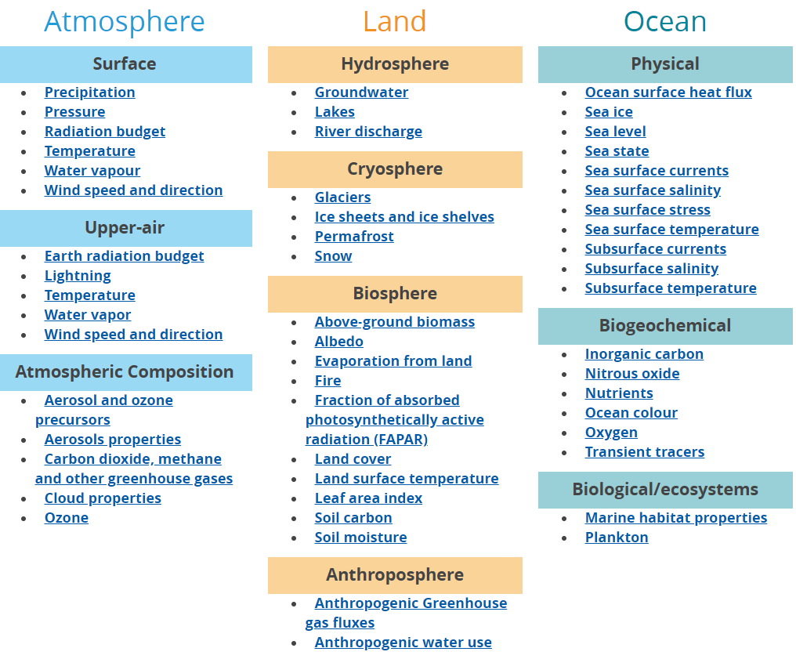 
*Source: [https://gcos.wmo.int/en/essential-climate-variables/ecv-factsheets](https://gcos.wmo.int/en/essential-climate-variables/ecv-factsheets)*

> ## Which Climate variables do you plan to use?
> Write in the workshop etherpad the list of variables you think would be useful for your study and at the same time write what you would like to do with climate data (area of application). 
> This is a preliminary list of variables and we will re-discuss it later after learning what is generally on offer.
>
{: .challenge}

# Types of climate data resources

When we talk about climate data, the type of data can vary significantly. We have very little actual observations at the scale of climate and usually not covering a large area. 

The type of climate data you will be using greatly depends on the period of time you are interested in:

- Observations
- Re-analyses
- Climate models

# Observations (or observational data)

Observations can be direct or indirect.

## Direct observations

These are measurements (from ground stations, buoys, satellites, etc.) of the occurrence of one or more physical variables (temperature, humidity, wind, etc.) at one or more particular times and places in and on the atmosphere, ocean, etc. 

Observations are described as **direct** when a physical parameter is measured directly, for example temperature or pressure at a land station. The sensors themselves can be either in-situ (hence providing information about their immediate environment) or remote (in which case they are able to measure over distances that extend significantly beyond the location of the instrument itself).

*Source: [https://uls.climate.copernicus.eu](https://uls.climate.copernicus.eu)*

Data coverage varies, depending on the type of observations to me achieved, and the quantities measured depend on the type of instruments.

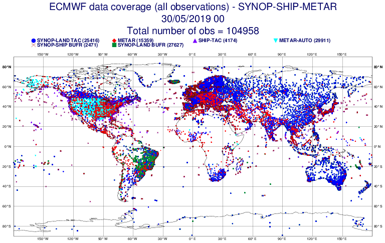
*Source: [ECMWF SYNOP-SHIP-METAR data coverage](https://www.ecmwf.int/en/forecasts/charts/monitoring/dcover?facets=undefined&time=2019053000,0,2019053000&obs=synop-ship&Flag=all)*

In addition, several satellites have been launched and are dedicated to the observation of the Earth System.

Satellites provide an increasing number of observations and allow to cover larger geographical areas.

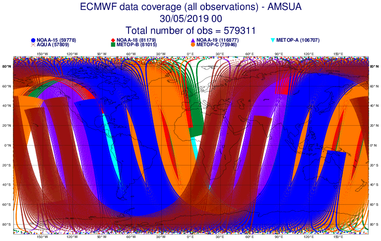
*Source: [ECMWF AMSUA data coverage](https://www.ecmwf.int/en/forecasts/charts/monitoring/dcover?facets=undefined&time=2019053000,0,2019053000&obs=AMSUA&Flag=all)*

However, the satellite signal has to be "translated" into climate variables and is often significantly perturbed by the atmosphere (clouds, etc.) thus introducing additional uncertainties and reducing the actual geographical coverage.

## Indirect observations

Observations are described as **indirect** when they are derived from other observations, for example information related to past climate (these are sometimes referred to as "climate proxies") can be inferred from tree rings (dendrochronology), lake sediments (varves) or ice cores.

*Source: [https://www.earth.columbia.edu](https://www.earth.columbia.edu/news/2004/story06-03-04.html)* 

Example taken from a Siberian pine tree in Mongolia where the distorted rings are evidence of a drastic cooling in the northern hemisphere (due to a massive volcanic eruption) that froze sap in the cells during the growing season in years 536-537 C.E. 

There are also other types of observations that we do not mention in this lesson (which does not claim to include an exhaustive list of everything available), and we will now talk about other tools that climate scientists use extensively: numerical models.

# Models

Numerical models are a mathematical representation of the climate developed by scientists to understand and predict the climate system. 
In order to be able to do this, the models divide the earth, ocean and atmosphere into one (or more) grid(s). The values of the predicted variables, such as surface pressure, wind, temperature, humidity and rainfall are calculated at each grid point over time, to predict their future values.

> ## Note: 
> Physical phenomena for which the governing equations are too complex or time consumming to solve numerically (typically
> radiative transfer), or small scale processes that cannot be resolved (i.e., cloud microphysics) are simplified or **parameterized**.
> However other processes, and in particular large-scale flows or circulations in the atmosphere and ocean, are generally *explicitly* resolved within the models.

{: .callout}

*Source: [https://www.climate.gov/maps-data/primer/climate-models](https://www.climate.gov/maps-data/primer/climate-models)*

## Re-analyses

A climate re-analysis gives a numerical description of the recent climate, produced by combining models with observations. It contains estimates of atmospheric parameters such as air temperature, pressure and wind at different altitudes, and surface parameters such as rainfall, soil moisture content, and sea-surface temperature. The estimates are produced for all locations on earth, and they span a long time period that can extend back decades or more.

Typically, this is done in a stepwise fashion, where a model provides a weather/climate forecast, which is then corrected on the basis of the observations.

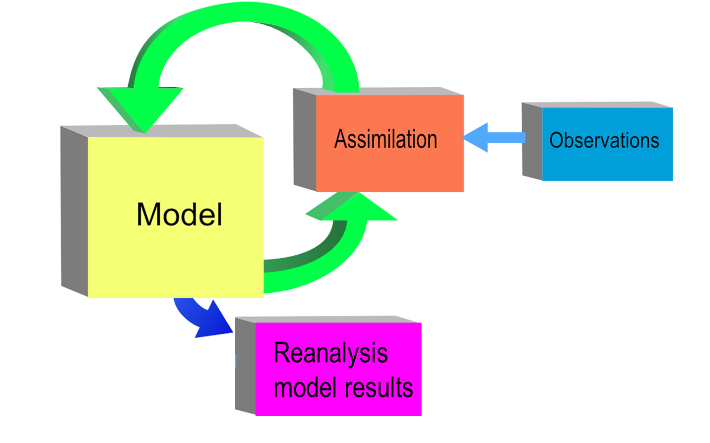

Re-analyses have the advantage to provide "homogeneous" long time series of a large number of climate variables, evenly covering all geographical areas on the globe, and they also take into account different sources of observations.

### Global re-analysis

There are [several global re-analysis datasets](https://reanalyses.org/). The quality of a re-analysis depends on the resolution of its model (including data assimilation method used) as well as the quality (and number) of observations assimilated.

> ## Note: 
> Some people erroneously call re-analysis products “gridded observational data” as if by some magic trick observations not
> made in the first place could be reinvented! Remember that there are values at each grid point and time only because a numerical
> weather prediction model was used and that this model only used the available measurements.
{: .callout}

In addition to re-analysing all the old data using a consistent system, the re-analyses also make use of much archived data that was not available to the original analyses. This is because in a weather centre only data arrived before the model runs start can be used, also not all the huge volume of satellite data can be processed and used, for obvious operational constraints, however they could have been of great value to improve the forecasting. This allows for corrections to be made at a later stage as well as filling gaps in areas where data was sparse. 

> ## ERA 5
> In this lesson, we will focus on the new re-analysis product (called ERA5) that has recently been released by [ECMWF](http:/www.ecmwf.int) as part of [Copernicus Climate Change Services](https://climate.copernicus.eu/). This product has higher spatial resolution (31 km) and covers the period from 1979 to present (and this will soon be extended back to 1950).
>
{: .callout}

### Regional re-analyses
 
For some applications a higher resolution in space and time is needed. Therefore, regional re-analyses are also produced.

Focusing on a smaller geographical region makes it possible to decrease the grid box size and time steps. There is also the opportunity to include additional observational data in the modelling process. The regional reanalysis uses boundary conditions from the global re-analysis in order to maintain the large scale dynamics of the system.

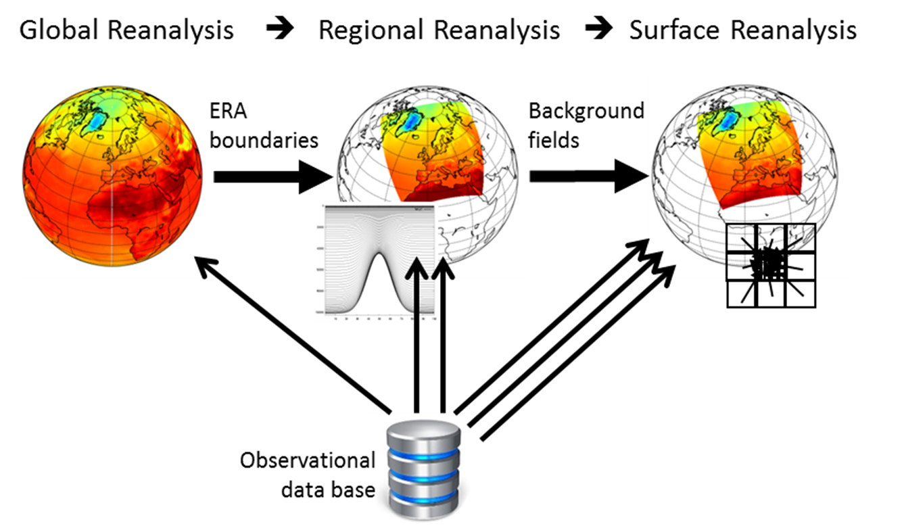

> ## [Regional Re-analysis for Europe (RRA)](https://climate.copernicus.eu/regional-reanalysis-europe) 
> It is provided by [Swedish Meteorological and Hydrological Institute](http://www.smhi.se/en).
> 
> The Copernicus Regional Reanalysis for Europe service produces and delivers a regional re-analysis (RRA) including long-term datasets of Essential Climate Variables (ECVs). Some pre-operational datasets are available from 1961 to near real-time at a horizontal resolution of 11km and/or 5km and temporal resolution of 4 times a day. Before using these datasets, check the [user guide](http://datastore.copernicus-climate.eu/c3s/published-forms/c3sprod/reanalysis-uerra-europe-soil-levels/D322_Lot1.4.1.2_User_guides_v2.9.pdf) as there are a number of limitations.
{: .callout}

## Climate modelling

### Different types of models

Various types of models are used to analyse different aspects of the climate. 
All have different ways to represent the real world, depending on how researchers prioritize and perform these simplifications (in terms of parameterizations, etc.) in the numerical climate model.
They will all provide different outputs but the collective results give a better overview of the real world than any single model.

There are many types of numerical climate models which differ by their complexity and coupling between various components (from more or less simplified atmosphere only models, to models where the atmosphere is coupled with land and/or ocean, and now full Earth system models including biogeochemistry, hydrology, land use, etc.). 

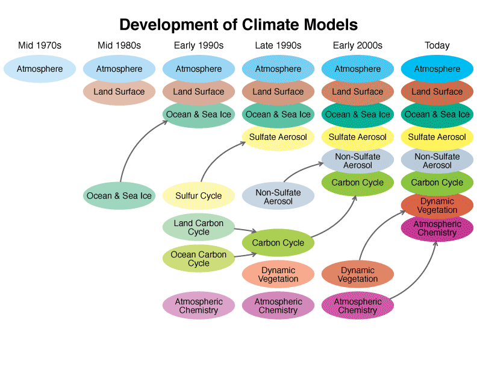
*Source: [https://www.giss.nasa.gov](https://www.giss.nasa.gov)*

As computing power has increased since the 1970s, so has the complexity of the computer models used to simulate Earth's climate. Most of the time individual components are developed separately and later coupled into more complex and comprehensive models which are then finely "tunned" so that the result is in line with the observed climate.

The models broadly fall into these categories:
* Global/General Climate/Circulation Models (GCM) and Earth System Models (ESM), which simulate the climate of the entire planete (generally with a coarse spatial resolution);
* Regional Climate Models (RCM), which focus on a limited area of the world (generally with a fine resolution);
* Variable Resolution Models (VR-Models), which use a coarse grid for the global domain and a variable horizontal mesh refinement over a region of interest:

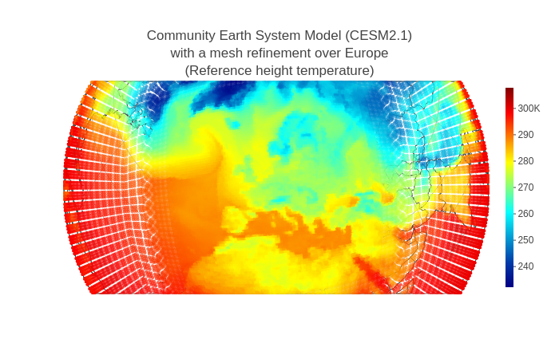

> ## Teaching tool for Earth System Modeling
> As a part of the [EVA](https://www.nersc.no/project/eva) project, where scientists developed the Norwegian Earth System Model ([NorESM](https://nordicesmhub.github.io/projects/noresm/)), a teaching tool was developed to show how climate modelers view the system around them.
>
> [Explore the Earth](https://expearth.uib.no/) to understand Climate systems!
> 
> {: .callout}

### Resolution of climate models

The capability of a climate model also depends on its resolution. We distinguish the **spatial resolution** and **temporal resolution** of a climate model. Very often a single model can be run with different resolutions and the choice is left to the scientist, depending on the scientific problem to tackle.

#### Spatial resolution

Spatial resolution specifies the size (in degrees of latitude and longitude or in km) of the grid cells in the climate model.

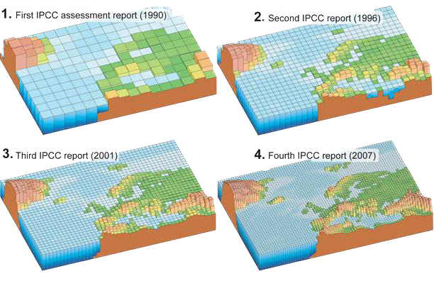
*Source: [https://nas-sites.org/climate-change/climatemodeling](https://nas-sites.org/climate-change/climatemodeling)*

#### Temporal resolution

Temporal resolution specifies the time steps used in the climate model e.g. how often computations of the various quantities (temperature, wind speed and directions, etc.) are done. A typical time step for a climate model is generally expressed in hours.

Even though we can get climate data for every day, we don't really care on which day and which exact location we get a certain value. 

## Climate projections

If the natural system is altered by assuming socio-economic trends, greenhouse gas emissions, or other activities by mankind, the climate models **project future climates**. These projections are scenarios of how humman’s activities may affect the natural climate.

### Climate prediction *vs.* projection

A **climate prediction** (or climate forecast) is an attempt to produce an estimate of the actual evolution of the natural climate in the future, for example, at seasonal, inter-annual or long-term time scales. Since the future evolution of the climate system may be highly sensitive to initial conditions, such predictions are usually probabilistic in nature.
**Climate projections** are distinct from climate predictions in that projections depend upon emission/concentration/radiative forcing **scenarios**, which are based on assumptions concerning, for example, future socio-economic and technological developments that may or may not be realized and are therefore subject to substantial uncertainty.

> ## Norwegian Earth System Model ([NorESM](https://no.wikipedia.org/wiki/NorESM))
>
> The Norwegian Earth System Model (NorESM) is a global, coupled model system for the physical climate system, which can be run with 
> various degrees of interactions with bio-geo-chemical processes in the earth system. NorESM is developed as a nationally coordinated 
> effort funded by the [Reseach Council of Norway](https://www.forskningsradet.no/). 
> NorESM is contributing with climate simulations to the [Coupled Model Intercomparison Project](https://www.wcrp-climate.org/wgcm-cmip) 
> (both [CMIP5](https://cmip.llnl.gov/cmip5/) and [CMPI6](https://pcmdi.llnl.gov/CMIP6/)). 
{: .callout}

> ## [Coupled Model Intercomparison Project](https://www.wcrp-climate.org/wgcm-cmip)
>
> The objective of the Coupled Model Intercomparison Project (CMIP) is to better understand past, present and future climate changes arising from natural, unforced variability or in response to changes in radiative forcing in a multi-model context. 
>
>  <iframe src="https://www.youtube.com/embed/WdRiYPJLt4o" width="560" height="315" frameborder="0" allowfullscreen="allowfullscreen"></iframe>
>
{: .callout}

### Representative Concentration Pathways (RCPs)

The [Intergovernmental Panel on Climate Change (IPCC)](https://www.ipcc.ch/) 
is the United Nations body for assessing the science related to climate change.
It was created to provide policymakers with regular scientific assessments on climate change, its implications and potential future risks, as well as to put forward adaptation and mitigation options.

Many factors have to be taken into account when trying to predict how future global warming will contribute to climate change. The amount of future greenhouse gas emissions is a key variable.  

A standard set of scenarios were defined by the IPCC and 
their primary purpose is to provide time-dependent projections of atmospheric greenhouse gas (GHG) concentrations.

These scenarios are built around the concept of RCP.

The “Representative Concentration Pathways” were defined by the IPCC for its 5th Assessment Report (AR5) in 2014 to provide plausible descriptions of the future, based on socio-economic scenarios of how global society grows and develops. These four RCPs (namely RCP2.6, RCP4.5, RCP6 and RCP8.5) are labelled after a possible range of radiative forcing values in the year 2100 corresponding to 2.6, 4.5, 6.0 and 8.5 W/m2, respectively.

Each RCP corresponds to certain socio-economic assumptions:

- **RCP2.6** - Low emissions: here radiative forcing reaches 3.1 W/m2 before it returns to 2.6 W/m2 by 2100. In order to reach such forcing levels, ambitious greenhouse gas emissions reductions would be required over time.

- **RCP4.5** - Intermediate emissions: here radiative forcing is stabilised shortly after year 2100, consistent with a future with relatively ambitious emissions reductions.

- **RCP6** - Intermediate emissions: this RCP is consistent with the application of a range of technologies and strategies for reducing greenhouse gas emissions.

- **RCP8.5** - High emissions: this RCP is consistent with a future with no policy changes to reduce emissions.

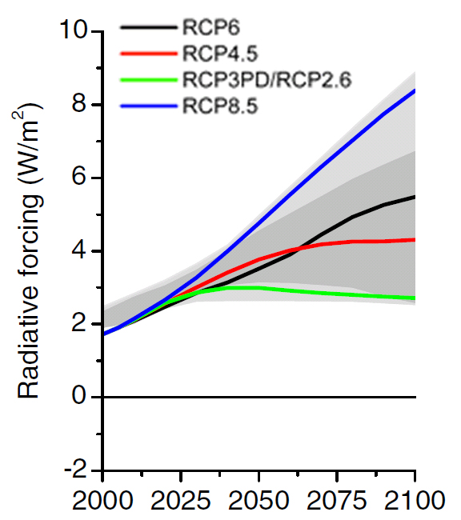
*Source: [https://sedac.ciesin.columbia.edu](https://sedac.ciesin.columbia.edu)*

The RCPs are named according to their 2100 radiative forcing level as reported by the individual modeling teams. More information about RCPs used for the 5th assessment can be found on the [RCP Database](http://tntcat.iiasa.ac.at:8787/RcpDb/dsd?Action=htmlpage&page=welcome). 

RCPs ensure that starting conditions, historical data and projections are employed consistently across the various branches of climate science.

> ## Radiative forcing
>
> **Power coming into Earth - Power leaving the Earth = Radiative Forcing Amount**
> 
>*Source: [The cloud-free global energy balance and inferred cloud radiative effects: an assessment based on direct observations and climate models](https://link.springer.com/article/10.1007%2Fs00382-018-4413-y)*
>
> When climate forcings result in incoming energy being greater than outgoing energy, the planet warms up. If outgoing energy is greater, the planet cools down.
>
{: .callout}

### Gases and pollutants included in the RCPs

- **Greenhouse gases**: CO2, methane, nitrous oxide, several groups of fluorocarbons and sulphur hexafluoride.
- **Aerosols and chemically active gasses**: Sulphur dioxide, soot, organic carbon, carbon monoxide, nitrogen oxides, volatile organic compounds, ammonia.

> ## RCP Database version 2.0.5
>
> Let's have a look at the [RCP Database version 2.0.5](http://tntcat.iiasa.ac.at:8787/RcpDb/dsd?Action=htmlpage&page=spatial#) to visualize CO emissions for "Surface transportation" under the 4 RCP scenarios.
> What do you observe?
> > ## Solution
> >
> > You should observe much higher values for RCP 8.5 towards year 2100 compared to RCP 2.6. 
> > 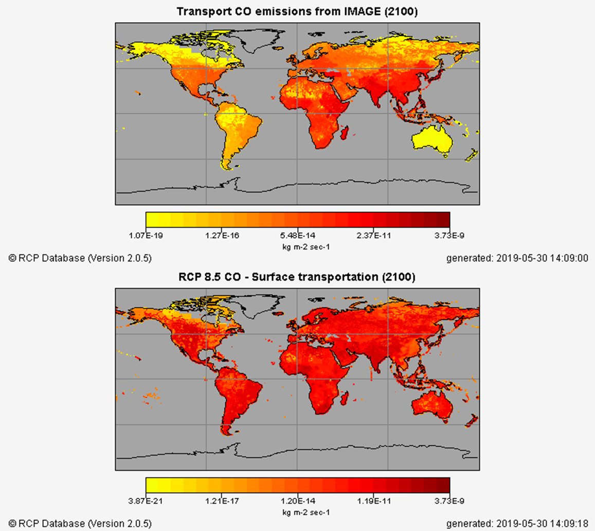
> >
> >For RCP 2.6, values significantly decreases between 2000 and 2100.
> >
> {: .solution}
>
{: .challenge}

### Shared Socioeconomic Pathways (SSP)

Over the past few years, an international team of climate scientists, economists and energy systems modellers have built a range of new “pathways” that examine how global society, demographics and economics might change over the next century. They are collectively known as the “Shared Socio-economic Pathways” (SSPs).

Information about the scenario process and the SSP framework can be found in [Moss et al. (2010)](http://www.nature.com/nature/journal/v463/n7282/full/nature08823.html), [van Vuuren et al. (2014)](http://link.springer.com/article/10.1007%2Fs10584-013-0906-1) and [O‘Neil et al. (2014)](http://link.springer.com/article/10.1007%2Fs10584-013-0905-2) and [Kriegler et al. (2014)](http://link.springer.com/article/10.1007%2Fs10584-013-0971-5). 


