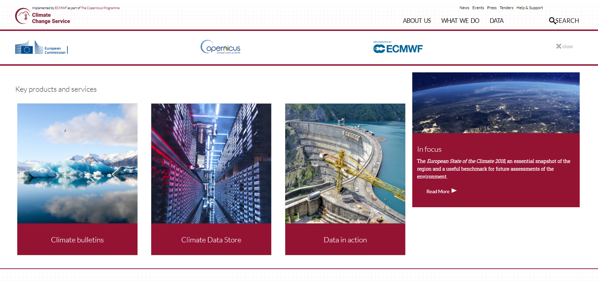
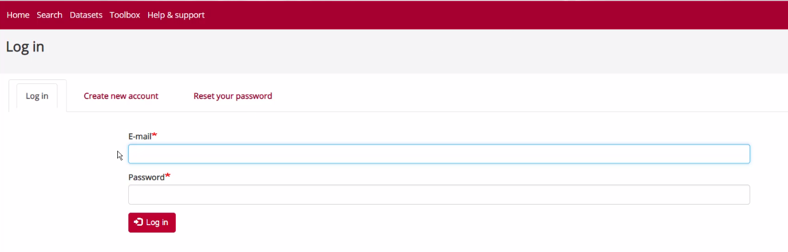
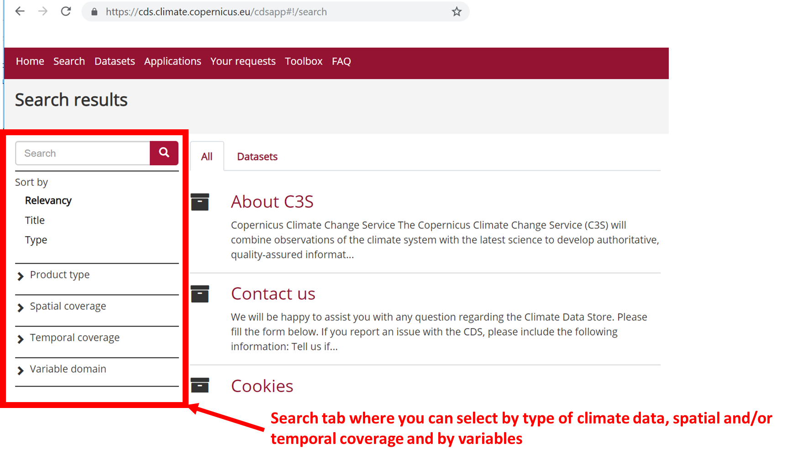
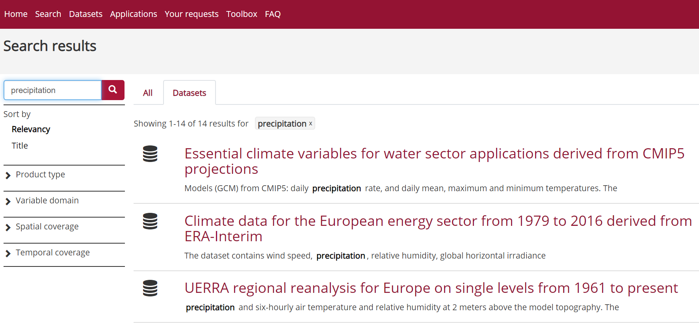
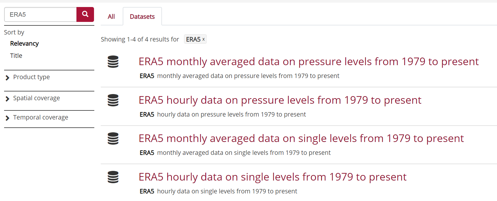
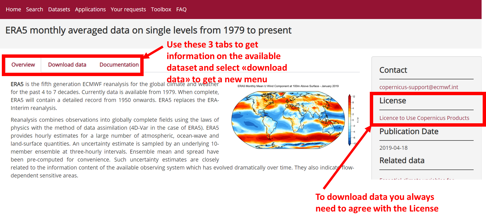
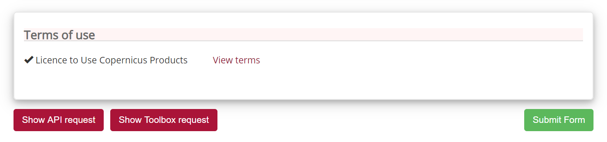
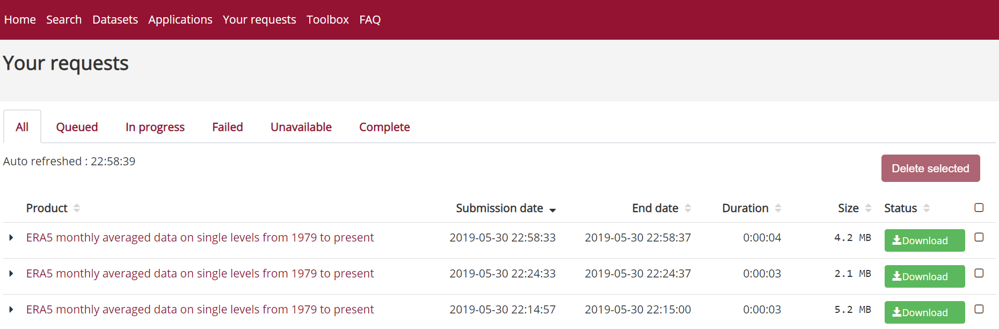

# Where to get Climate data?

There are many online services to get climate data, and it is often difficult to know which ones are up-to date and which resources to trust. Also different services provide different Application Programming Interfaces (API), use different terminologies, different file formats etc.,  which make it difficult for new users to master them all. Therefore in this lesson, we will be focusing on the [Copernicus Climate Change Service (C3S)](https://climate.copernicus.eu/).

# Copernicus Climate Change Service (C3S)

This is a service operated by the [European Centre for Medium-range Weather Forecasts (ECMWF)](https://www.ecmwf.int/) on behalf of the European Union. The [C3S](https://climate.copernicus.eu/) combines observations of the climate system with the latest science to develop **authoritative**, **quality-assured** information about the past, current and future states of the climate in Europe and worldwide.

# The Climate Data Store (CDS)

This is a web portal providing a single point of access to a wide range of information. This includes observations (i.e., in-situ measurements, remote sensing data, etc.), historical climate data records, estimates of Essential Climate Variables (ECVs) derived from Earth observations, global and regional climate reanalyses of past observations, seasonal forecasts and climate projections.

> ## Climate Data Store (CDS) Registration
> To be able to use CDS services, you need to [register](https://cds.climate.copernicus.eu/user/login?destination=%2F%23!%2Fhome).
> Registration to the Climate Data Store (CDS) is free as well as access to
> climate data.
>
{: .callout}

Before starting, and once registred, login to the Climate Data Store (CDS).

## Search data in the Climate Data Store

Once login, click on the [Search](https://cds.climate.copernicus.eu/cdsapp#!/search) button:

If you click on "Product Type", you will get the list of available climate data types:

- Climate projections
- Reanalysis
- Satellite observations
- Seasonal forecasts
- Sectorial climate indices

> ## Which product type should I choose?
> You probably recognize the first 3 product types from the previous
> lesson, so let us do a small exercise.
>
> Alice is a Master's student and need climate data for the period 1998-2003.
> Which product types can she use?
> What criteria could she use to make her final choice?
> > ## Solution
> > Alice could use:
> > - Climate projections
> > - Reanalysis
> > - Satellite observations
> and her final choice depends on the variable, the spatial and temporal resolution.
> {: .solution}
>
{: .challenge}

You can also search by entering a key word:
- reanalysis
- cmip
- temperature
- precipitation, etc.

When you search, you can make sure you only get datasets (and not documentation, etc.) by selecting the tab "Datasets"

As you can see, it is important to know what you are looking for before starting to download datasets. We will see in the next section that the size of the datasets can also be an important criteria to take into account before starting downloading Climate data.

## Downloads data from the Climate Data Store

We are nearly there! And the best is to try it out.

Let's search for the last available re-analysis. We can search for "ERA5" and it will return the list of available datasets:

> ## Single level versus pressure levels
>
> Let's stop here and discuss the results of our search:
> - single levels are usually for variables available at (or close) to the surface.
> - data on pressure levels give information on the vertical structure of the atmosphere.
>
> For many practical applications, using single level (surface) data is sufficient.
{: .callout}

We will select [ERA5 monthly averaged data on single levels from 1979 to present](https://cds.climate.copernicus.eu/cdsapp#!/dataset/reanalysis-era5-single-levels-monthly-means?tab=overview).

> ## License
> To be able to download datasets from the Climate Data Store, you need to
> agree with the corresponding data license. This agreement can only be done online.
{: .callout}

Let's look at the default selected boxes:
- **Product type**: Monthly averaged ensemble members
- **Variable**: 2m temperature
- **Year**: 2019
- **Month**: June
- **Time**: 00:00
- **Format**: NetCDF 

Please note that the year, month and time may be different (depends on the current date when the request is done!).

And apart from the date, all the other default values introduce notions we do not understand yet!

### What is an ensemble?

Ensemble modelling is a method used to give an indication of the range of possible future states of the Earth (here the atmosphere). 
Instead of making one single simulation, a set (or ensemble) of simulation is produced. 

Multiple simulations are run, each with a slight variation of its initial conditions and with slightly perturbed models. These variations represent the inevitable uncertainty in the initial conditions and approximations in the models. They produce a range of possible values.

### What is a member?

A member from an ensemble simulation is one single simulation among the set of perturbed runs. To ease identification, we give a number to each of the perturbed runs.

So for instance the member 0 is usually associated to what we call the control run e.g. the simulation has not been perturbed.

When selecting "Monthly averaged ensemble members" of ERA 5 data as *Product type* and one variable and date only, you will get 10 different fields covering the entire globe. 

ERA5 provides an estimate of uncertainty through the use
of a 10-member ensemble of data assimilations (EDA) at a
coarser resolution (63 km horizontal resolution) and 3-hourly
frequency.

### How to use ensemble simulations?

Downloading ensemble simulations is useful to get an indication of the variability of a particular parameter and for statistical analysis.

## What is 2m temperature?

We selected [ERA5 monthly averaged data on single levels from 1979 to present](https://cds.climate.copernicus.eu/cdsapp#!/dataset/reanalysis-era5-single-levels-monthly-means?tab=form) so we expected to get surface variables only.

In fact, we get all the variables on a single level and usually close to the surface. Here *2m temperature* is computed as the temperature at a reference height (2 metres).

## Data format: GRIB versus NetCDF

### GRIB

[GRIB](https://en.wikipedia.org/wiki/GRIB) (GRIdded Binary or General Regularly-distributed Information in Binary form)

### NetCDF

[NetCDF](https://en.wikipedia.org/wiki/NetCDF)

## Manage data requests in the Climate Data Store

When clicking on "Submit Form", your data request is "posted" and you can then download your data once your request is done.

All your recent requests will be available and you can then download data locally on your laptop.
However, as we have discussed briefly in the previous section, the data format prevents us to easily analyze and visualize the downloaded data. We will need tools that understand netCDF or GRIB. This is what we will discuss in the next lessons.

> ## Note
> We will not explain the meaning of the "Show API request" button yet. 
> We will come back to it in the next lessons.
{: .callout}

## The Climate Data Store toolbox

In this section, we will briefly introduce the Climate Data Store toolbox.

### "Show Toolbox request" 



