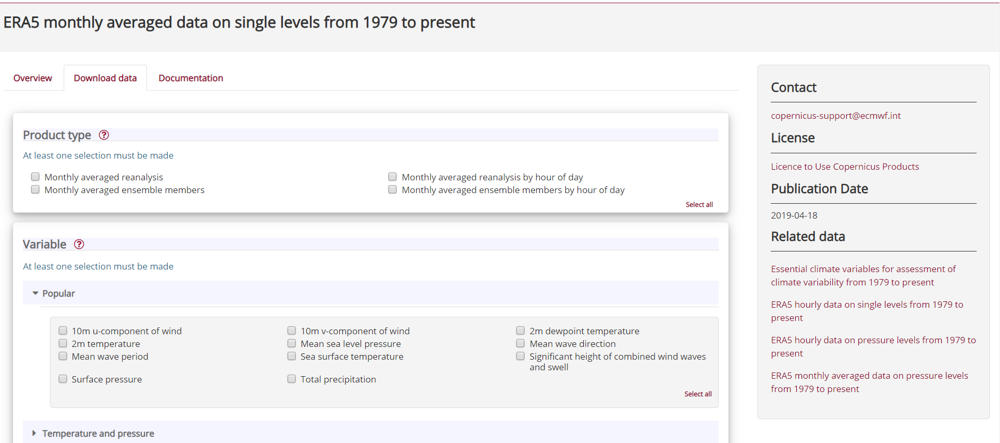
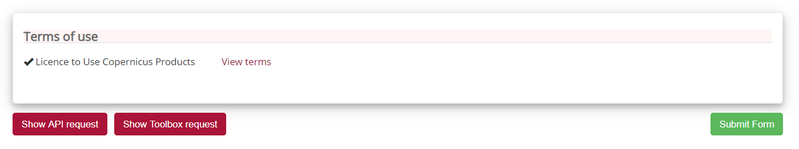
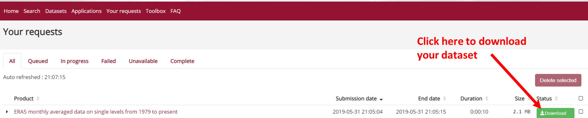

# Where to get Climate data?

There are many online services to get climate data, and it is often difficult to know which ones are up-to date and which resources to trust. Also different services provide different Application Programming Interfaces (API), use different terminologies, different file formats etc.,  which make it difficult for new users to master them all. Therefore in this lesson, we will be focusing on the [Copernicus Climate Change Service (C3S)](https://climate.copernicus.eu/).

# Copernicus Climate Change Service (C3S)

This is a service operated by the [European Centre for Medium-range Weather Forecasts (ECMWF)](https://www.ecmwf.int/) on behalf of the European Union. The [C3S](https://climate.copernicus.eu/) combines observations of the climate system with the latest science to develop **authoritative**, **quality-assured** information about the past, current and future states of the climate in Europe and worldwide.

# The Climate Data Store (CDS)

This is a web portal providing a single point of access to a wide range of information. This includes observations (i.e., in-situ measurements, remote sensing data, etc.), historical climate data records, estimates of Essential Climate Variables (ECVs) derived from Earth observations, global and regional climate reanalyses of past observations, seasonal forecasts and climate projections.

> ## Climate Data Store (CDS) Registration
> To be able to use CDS services, you need to [register](https://cds.climate.copernicus.eu/user/login?destination=%2F%23!%2Fhome).
> Registration to the Climate Data Store (CDS) is free as well as access to
> climate data.
>
{: .callout}

Before starting, and once registred, login to the Climate Data Store (CDS).

## Search data in the Climate Data Store

Once login, click on the [Search](https://cds.climate.copernicus.eu/cdsapp#!/search) button:

If you click on "Product Type", you will get the list of available climate data types:

- Climate projections
- Reanalysis
- Satellite observations
- Seasonal forecasts
- Sectorial climate indices

> ## Which product type should I choose?
> You probably recognize the first 3 product types from the previous
> lesson, so let us do a small exercise.
>
> Alice is a Master's student working on draught in Europe over the period 1998-2018, and she wants to look at precipitation data for summer months in 2003 to start with (because she heard about a period of excessively hot and dry weather occuring then).
>
> Which product(s) types can she use?
>
> Which criteria could she use to make her final choice?
> > ## Solution
> > Alice could use:
> > - Climate projections
> > - Reanalysis
> > - Satellite observations
> >
> > and her final choice depends on the variable, the spatial and temporal resolution.
> {: .solution}
>
{: .challenge}

You can also search by entering a key word:
- reanalysis
- cmip
- temperature
- precipitation, etc.

When you search, you can make sure you only get datasets (and not documentation, etc.) by selecting the tab "Datasets"

As you can see, it is important to know what you are looking for before starting to download datasets. And the best approach is usually to narrow it down as much as possible to avoid having to download unecessary data. We will see in the next section that the size of the datasets can also be an important criteria to take into account before starting downloading Climate data. 

## Downloads data from the Climate Data Store

We are nearly there! And the best is to try it out.

Let's search for the last available re-analysis. We can search for "ERA5" and it will return the list of available datasets:

> ## Single level versus pressure levels
>
> Let's stop here and discuss the results of our search:
> - single levels are usually for variables available at (or close) to the surface.
> - data on pressure levels give information on the vertical structure of the atmosphere.
>
> For many practical applications, using single level (surface) data is sufficient.
{: .callout}

We will select [ERA5 monthly averaged data on single levels from 1979 to present](https://cds.climate.copernicus.eu/cdsapp#!/dataset/reanalysis-era5-single-levels-monthly-means?tab=overview).

> ## License
> To be able to download datasets from the Climate Data Store, you need to
> agree with the corresponding data license. This agreement can only be done online.
{: .callout}

Click on the tab "Download data" so we can select some ERA5 data to download:

Let's select:
- **Product type**: Monthly averaged reanalysis
- **Popular**: Total precipitation
- **Year**: 2003
- **Month**: June
- **Time**: 00:00
- **Format**: NetCDF 

Make sure you agree to **Terms of use** and then click on **Submit form**:

You will then be re-directed to the list of your requests from where you can download your dataset once the retrieval is done:

 

If your retrieval is successful then click on the "download" button to download. 
When there is any issue when retrieving data, you request will be "marked" as **failed**.

Please note that it is always good practice to select a small sample of data (in the present instance we take only one month) to check that it meets your needs!

Another issue here may be that apart from the variable and date, all the other boxes ticked involve notions that we do not understand yet!

However, for now let's concentrate on the dataset we downloaded to make our first plot.

> ## What is total precipitation?
> 
> When we select total precipitation from [ERA5 monthly averaged data on single levels from 1979 to present](https://cds.climate.copernicus.eu/cdsapp#!/dataset/reanalysis-era5-single-levels-monthly-means?tab=form), how can we have a description of the variable?
> 
> Each variable is described in the [Overview](https://cds.climate.copernicus.eu/cdsapp#!/dataset/reanalysis-era5-single-levels-monthly-means?tab=overview).
> 
> - **Total precipitation**: *m* (metre)
> 
> You can also check it in the [Climate Essential Variables](https://gcos.wmo.int/en/essential-climate-variables/ecv-factsheets) where it can be found under [Precipitation](https://ane4bf-datap1.s3.eu-west-1.amazonaws.com/wmod8_gcos/s3fs-public/precipitation_ecv_factsheet_201905.pdf?Y3ybZeunAm83xo9wjBWZg5_Sa50uaXga):
> 
> *Precipitation, either liquid or solid, is the most important climate variable directly affecting humans. Through either its duration, intensity and frequency or its lack of occurrence, it influences the supply of water, causes risks to life and livelihoods when associated with floods, landslides and droughts, and affects infrastructure planning, leisure activities and more. Precipitation is closely related to cloud properties, a number of terrestrial ECVs and to ocean-surface salinity. It is indicative of the release of latent heat within the energy cycle, as well as being at the heart of the hydrological cycle.*
> 
{: .callout}

## What data format for Climate data?

Climate data can become large very quickly (as we usually need to analyze data over large period of time and covering large geographical areas) so we do not store them as text files (csv, tabular, etc.) to compress them as much as possible without loosing any important information.

All Climate data are stored in **binary** format and are not *human readable*.

Depending on the type of Climate data, you may have the choice between several data formats:

- [GRIB](https://en.wikipedia.org/wiki/GRIB)
- [NetCDF](https://en.wikipedia.org/wiki/NetCDF)

> ## Data format: GRIB versus NetCDF
>
> 
> ### NetCDF
>
> [NetCDF](https://en.wikipedia.org/wiki/NetCDF)  ([Network Common Data Form](https://www.unidata.ucar.edu/software/netcdf/)) is a set of software libraries and self-describing, machine-independent data formats that support the creation, access, and sharing of array-oriented scientific data. NetCDF is commonly used to store and distribute scientific data. 
> The NetCDF software was developed at the [Unidata Program Center](http://www.unidata.ucar.edu/publications/factsheets/current/factsheet_netcdf.pdf) in Boulder, Colorado, USA. 
> NetCDF files usually have the extension *.nc*. 
> As for the GRIB format, NetCDF files are binary and you need to use specific tools to read them. NetCDF files can also be manipulated with most programming languages (R, Python, C, Fortran, etc.).
> 
> For climate and forecast data stored in NetCDF format there are (non-mandatory) conventions on metadata ([CF Convention](http://cfconventions.org/)). 
> 
> ### GRIB
>
> [GRIB](https://en.wikipedia.org/wiki/GRIB) (GRIdded Binary or General Regularly-distributed Information in Binary form) is a file format designed for storing and distributing weather data. GRIB files are mostly used in meteorological applications. The last ECMWF re-analysis (ERA5) is natively encoded in GRIB and also in a version converted from GRIB to NetCDF. Note that due to limitations of the NetCDF specifications, the NetCDF version contains fewer parameters (variables) and incomplete metadata (information about the data). 
> As this format is not widely used there are not as many tools or programming languages supported as netCDF.
>
{: .callout}

Whenever we can, we will choose to download data in NetCDF format but we will also add links to documentation with examples using native GRIB format.

NetCDF format is a binary format and to be able to read or visualize it, we would need to use dedicated software or libraries that can handle this "special" format.

Then depending on whether you wish to visualize your data with [Python](../03-visualization-python) or [R](../04-visualization-R),
follow the corresponding instructions.



