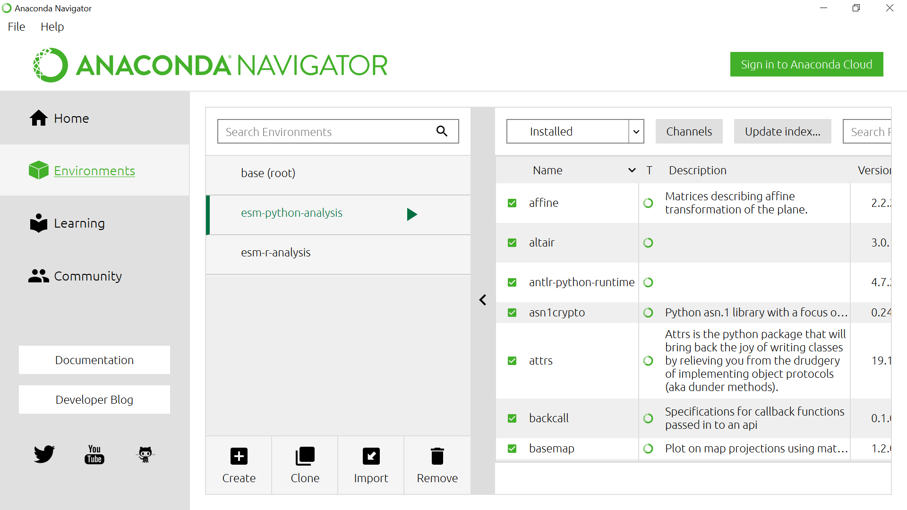
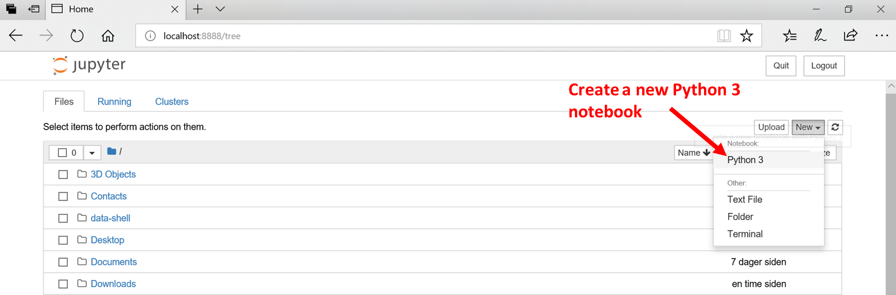
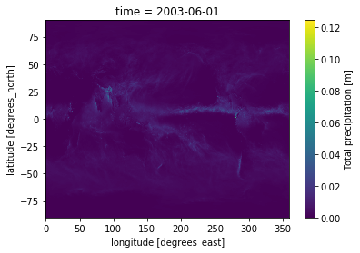
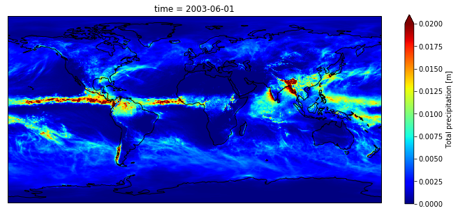
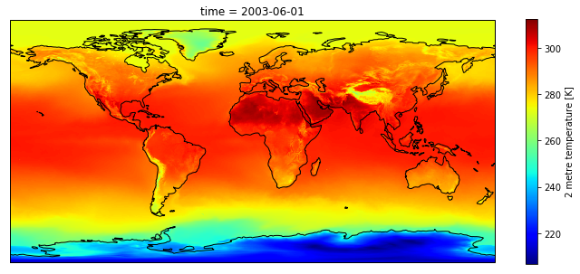
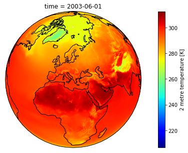

# Quick visualization 

In this section, we will learn to read the metadata and visualize the NetCDF file we just downloaded.

Make sure you have either install Python and R along with the additional packages required to read Climate data files as described in the [setup](../setup) instructions.

The file we downloaded from CDS should be in your `Downloads` folder; to check it out, open a Terminal (Git bash terminal on windows) and type:

~~~
ls ~/Downloads/*.nc
~~~
{: .language-bash}

`*.nc` means that we are looking for any files with a suffix `.nc` (NetCDF file).

~~~
adaptor.mars.internal-1559329510.4428957-10429-22-1005b553-e70d-4366-aa63-1424db2df740.nc
~~~
{: .output}

Then rename this file to a more friendly filename (please note that to ease further investigation, we add the date in the filename).

For instance, using `bash`:

~~~
mv ~/Downloads/adaptor.mars.internal-1559329510.4428957-10429-22-1005b553-e70d-4366-aa63-1424db2df740.nc ~/Downloads/ERA5_REANALYSIS_precipitation_200306.nc

ls ~/Downloads/*.nc
~~~
{: .language-bash}

~~~
ERA5_REANALYSIS_precipitation_200306.nc
~~~
{: .output}

[Start Anaconda Navigator](https://docs.anaconda.com/anaconda/navigator/getting-started/#navigator-starting-navigator) and select **Environments**:

Select **esm-python-analysis** environment and **Open with Jupyter Notebook**:

## Get metadata

~~~
import xarray as xr

# the line above is necessary for getting 
# your plot embedded within the notebook
%matplotlib inline

dset = xr.open_dataset("~/Downloads/ERA5_REANALYSIS_precipitation_200306.nc")
print(dset)
~~~
{: .language-python}
	  
Printing `dset` returns `ERA5_REANALYSIS_precipitation_200306.nc` metadata:

~~~
<xarray.Dataset>
Dimensions:    (latitude: 721, longitude: 1440, time: 1)
Coordinates:
  * longitude  (longitude) float32 0.0 0.25 0.5 0.75 ... 359.25 359.5 359.75
  * latitude   (latitude) float32 90.0 89.75 89.5 89.25 ... -89.5 -89.75 -90.0
  * time       (time) datetime64[ns] 2003-06-01
Data variables:
    tp         (time, latitude, longitude) float32 ...
Attributes:
    Conventions:  CF-1.6
    history:      2019-05-31 19:05:13 GMT by grib_to_netcdf-2.10.0: /opt/ecmw...
~~~
{: .output}

We can see that our `dset` object is an `xarray.Dataset`, which when printed shows all the metadata associated with our netCDF data file.

In this case, we are interested in the precipitation variable contained within that xarray Dataset:

~~~
print(dset['tp'])
~~~
{: .language-python}

~~~
<xarray.DataArray 'tp' (time: 1, latitude: 721, longitude: 1440)>
[1038240 values with dtype=float32]
Coordinates:
  * longitude  (longitude) float32 0.0 0.25 0.5 0.75 ... 359.25 359.5 359.75
  * latitude   (latitude) float32 90.0 89.75 89.5 89.25 ... -89.5 -89.75 -90.0
  * time       (time) datetime64[ns] 2003-06-01
Attributes:
    units:      m
    long_name:  Total precipitation
~~~
{: .output}

## Quick visualization

~~~
dset['tp'].plot()
~~~
{: .language-python}

We can change the [colormap](https://matplotlib.org/users/colormaps.html) and 
adjust the maximum (remember the total precipitation is in metre):

~~~
dset['tp'].plot(cmap='jet', vmax=0.02)
~~~
{: .language-python}

We can see there is a band with *lot* of rain. Let's add continents and a projection using cartopy:

~~~
import matplotlib.pyplot as plt
import cartopy.crs as ccrs

fig = plt.figure(figsize=[12,5])

# 111 means 1 row, 1 col and index 1
ax = fig.add_subplot(111, projection=ccrs.PlateCarree(central_longitude=0))

dset['tp'].plot(ax=ax, vmax=0.02, cmap='jet',
                   transform=ccrs.PlateCarree())
ax.coastlines()

plt.show()
~~~
{: .language-python}

At this stage, do not bother too much about the [projection](https://scitools.org.uk/cartopy/docs/latest/crs/projections.html) e.g. `ccrs.PlateCarree`. 
We will discuss it in-depth in a follow-up episode.

> ## Retrieve surface air temperature
> 
> From the same product type ([ERA5 single levels Monthly means](https://cds.climate.copernicus.eu/cdsapp#!/dataset/reanalysis-era5-single-levels-monthly-means?tab=form))
> select *2m temperature*. Make sure you rename your file to *ERA5_REANALYSIS_air_temperature_200306.nc*
> 
> - Inspect metadata of the new retrieved file
> - Visualize *2m temperature* with Python
>
> > ## Solution with Python
> > ~~~
> > dset = xr.open_dataset("~/Downloads/ERA5_REANALYSIS_air_temperature_200306.nc")
> > print(dset)
> >
> > import matplotlib.pyplot as plt
> > import cartopy.crs as ccrs
> >
> > fig = plt.figure(figsize=[12,5])
> >
> > # 111 means 1 row, 1 col and index 1
> > ax = fig.add_subplot(111, projection=ccrs.PlateCarree(central_longitude=0))
> > 
> > dset['t2m'].plot(ax=ax,  cmap='jet',
> >                    transform=ccrs.PlateCarree())
> > ax.coastlines()
> > 
> > plt.show()
> > ~~~
> > {: .language-python}
> > 
> {: .solution}
>
{: .challenge}

> ## What is 2m temperature?
> We selected [ERA5 monthly averaged data on single levels from 1979 to present](https://cds.climate.copernicus.eu/cdsapp#!/dataset/reanalysis-era5-single-levels-monthly-means?tab=form) so we expected to get surface variables only.	
> In fact, we get all the variables on a single level and usually close to the surface. Here *2m temperature* is computed as 
> the temperature at a reference height (2 metres). This corresponds to the [surface air temperature](https://ane4bf-datap1.s3.eu-west-1.amazonaws.com/wmod8_gcos/s3fs-public/surface_temp_ecv_factsheet_201905.pdf?Yq5rPAs1YJ2iYVCutXWLnG_lTV.pRDb6). 
>
{: .callout}

## Change projection

It is very often convenient to visualize using a different projection than the original data:

~~~
import matplotlib.pyplot as plt
import cartopy.crs as ccrs

fig = plt.figure(figsize=[12,5])

# 111 means 1 row, 1 col and index 1
ax = fig.add_subplot(111, projection = ccrs.Orthographic(central_longitude=20, central_latitude=40))

dset['t2m'].plot(ax=ax,  cmap='jet',
                   transform=ccrs.PlateCarree())
ax.coastlines()

plt.show()
~~~
{: .language-python}

> ## Plot surface air temperature and precipitation with CMIP5 (June 2003)
> 
> 
{: .challenge}

# Interactive visualization

# Retrieve Climate data with CDS API

## Select area



