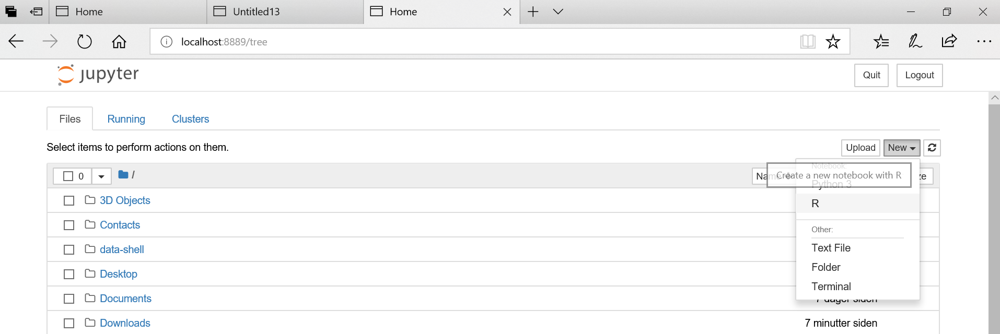

# Quick visualization 

In this section, we will learn to read the metadata and visualize the NetCDF file we just downloaded.

Make sure you have either install Python and R along with the additional packages required to read Climate data files as described in the [setup](../setup) instructions.

The file we downloaded from CDS should be in your `Downloads` folder; to check it out, open a Terminal (Git bash terminal on windows) and type:

~~~
ls ~/Downloads/*.nc
~~~
{: .language-bash}

`*.nc` means that we are looking for any files with a suffix `.nc` (NetCDF file).

~~~
adaptor.mars.internal-1559329510.4428957-10429-22-1005b553-e70d-4366-aa63-1424db2df740.nc
~~~
{: .output}

Then rename this file to a more friendly filename (please note that to ease further investigation, we add the date in the filename).

For instance, using `bash`:

~~~
mv ~/Downloads/adaptor.mars.internal-1559329510.4428957-10429-22-1005b553-e70d-4366-aa63-1424db2df740.nc ~/Downloads/ERA5_REANALYSIS_precipitation_200306.nc

ls ~/Downloads/*.nc
~~~
{: .language-bash}

~~~
ERA5_REANALYSIS_precipitation_200306.nc
~~~
{: .output}

[Start Anaconda Navigator](https://docs.anaconda.com/anaconda/navigator/getting-started/#navigator-starting-navigator) and select **Environments**:

## Quick visualization with R

      
Select **esm-r-analysis** environment and **Open with Jupyter Notebook**:

> ## Retrieve surface air temperature
> 
> From the same product type ([ERA5 single levels Monthly means](https://cds.climate.copernicus.eu/cdsapp#!/dataset/reanalysis-era5-single-levels-monthly-means?tab=form))
> select *2m temperature*. Make sure you rename your file to *ERA5_REANALYSIS_air_temperature_200306.nc*
> 
> - Inspect metadata of the new retrieved file
> - Visualize *2m temperature* with R-notebook
>
> > ## Solution with R
> >
> {: .solution}
>
{: .challenge}

> ## What is 2m temperature?
> We selected [ERA5 monthly averaged data on single levels from 1979 to present](https://cds.climate.copernicus.eu/cdsapp#!/dataset/reanalysis-era5-single-levels-monthly-means?tab=form) so we expected to get surface variables only.	
> In fact, we get all the variables on a single level and usually close to the surface. Here *2m temperature* is computed as 
> the temperature at a reference height (2 metres). This corresponds to the [surface air temperature](https://ane4bf-datap1.s3.eu-west-1.amazonaws.com/wmod8_gcos/s3fs-public/surface_temp_ecv_factsheet_201905.pdf?Yq5rPAs1YJ2iYVCutXWLnG_lTV.pRDb6). 
>
{: .callout}

> ## Plot surface air temperature from CMIP5 (June 2003)
> 
> 
{: .challenge}

# Retrieve Climate data with CDS API
## Select area



