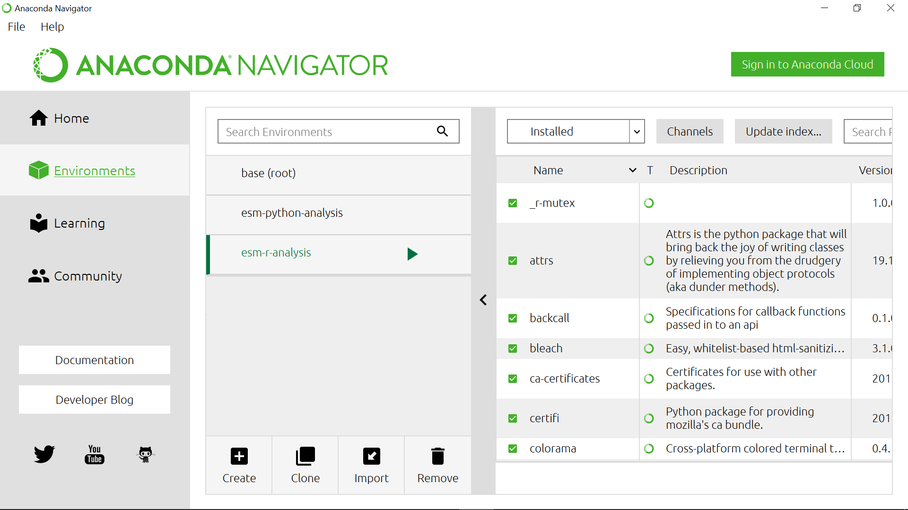
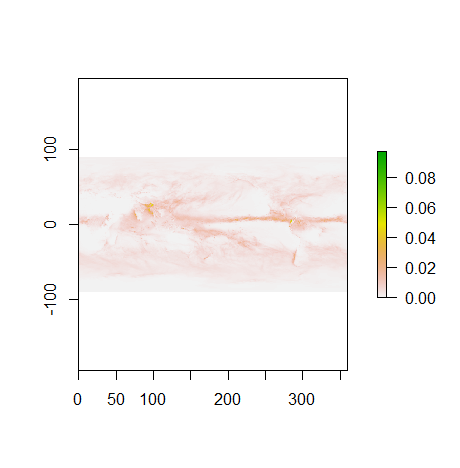
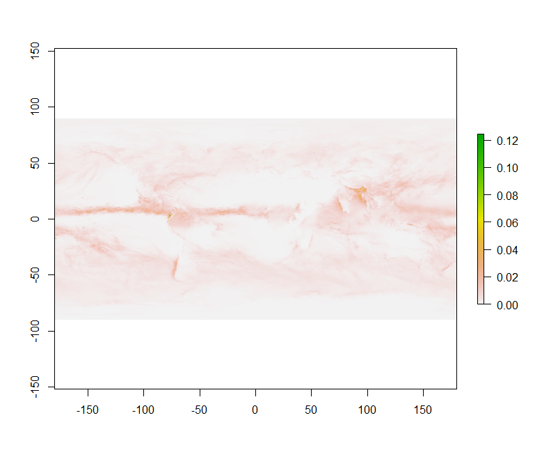
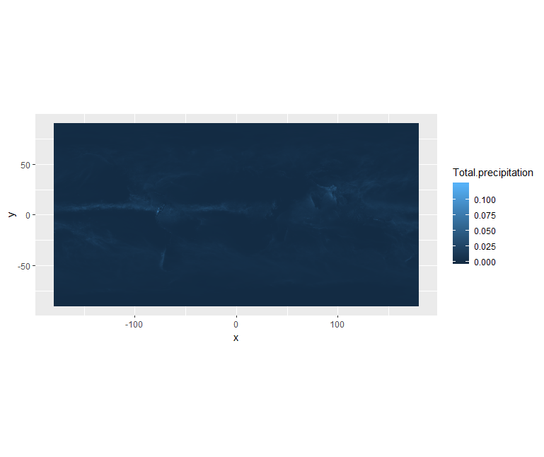
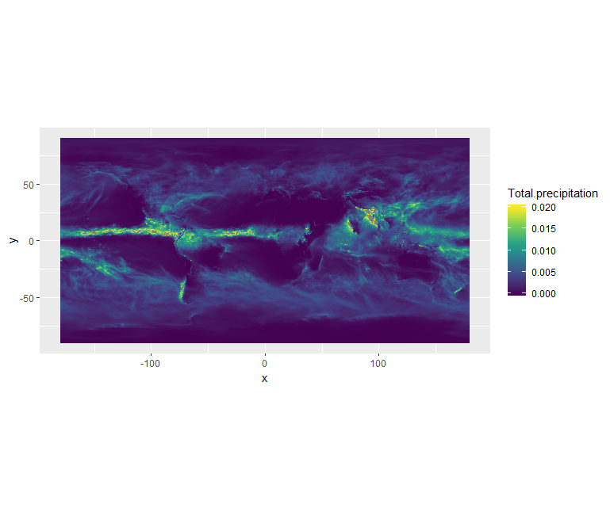
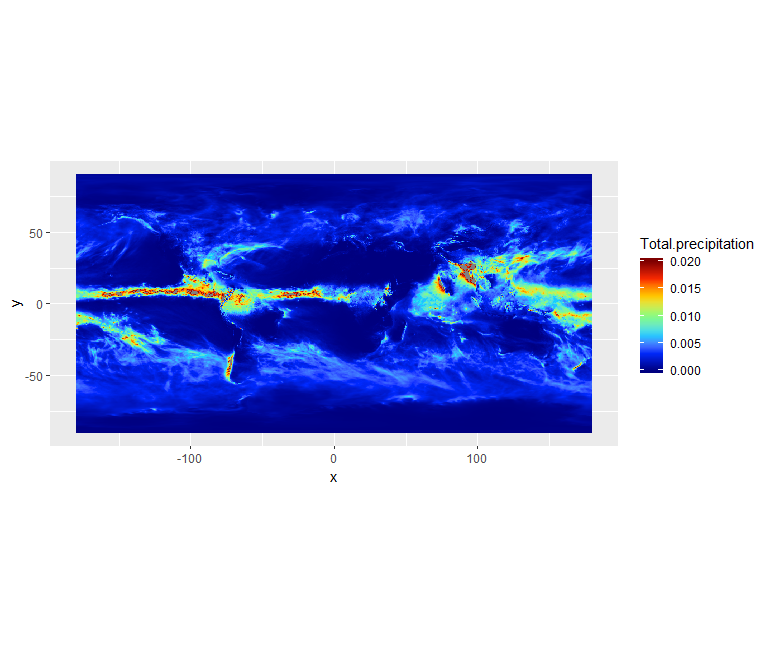
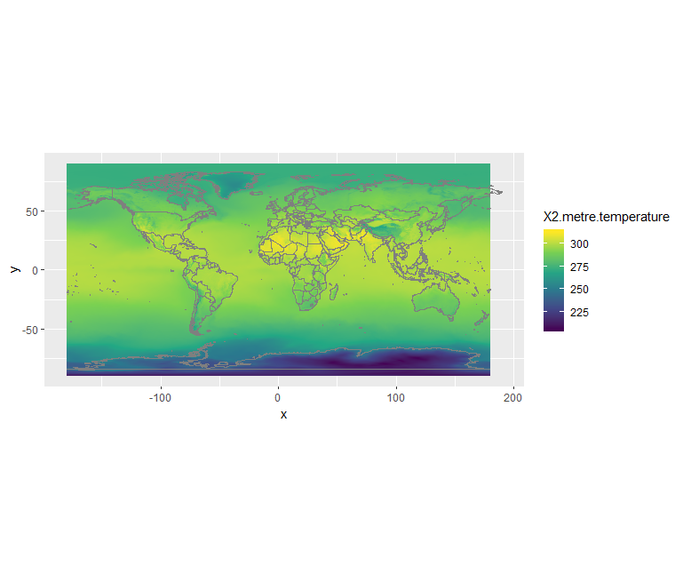
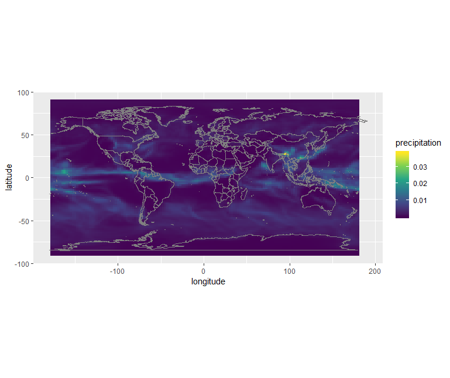
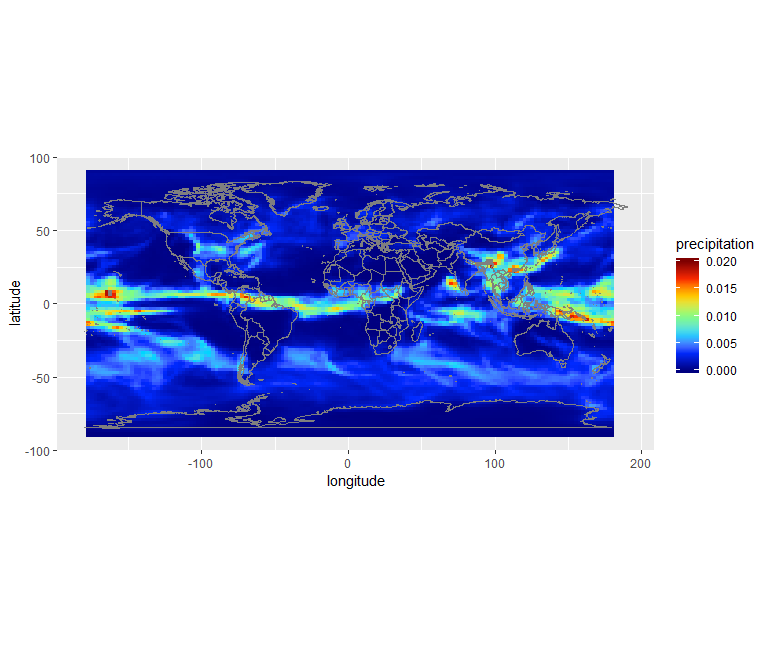
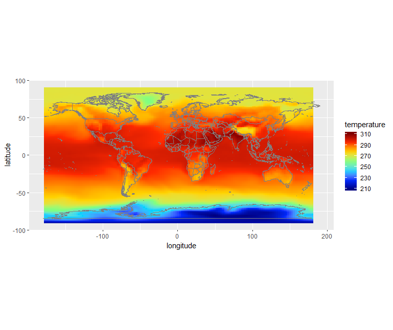

# Quick visualization 

In this section, we will learn to read the metadata and visualize the NetCDF file we just downloaded.

Make sure you have installed R along with the additional packages required to read Climate data files 
as described in the [setup](../setup) instructions.

The file we downloaded from CDS should be in your `Downloads` folder; to check it out, open a Terminal (Git bash terminal on windows) and type:

~~~
ls ~/Downloads/*.nc
~~~
{: .language-bash}

`*.nc` means that we are looking for any files with a suffix `.nc` (NetCDF file).

~~~
adaptor.mars.internal-1559329510.4428957-10429-22-1005b553-e70d-4366-aa63-1424db2df740.nc
~~~
{: .output}

Then rename this file to a more friendly filename (please note that to ease further investigation, we add the date in the filename).

For instance, using `bash`:

~~~
mv ~/Downloads/adaptor.mars.internal-1559329510.4428957-10429-22-1005b553-e70d-4366-aa63-1424db2df740.nc ~/Downloads/ERA5_REANALYSIS_precipitation_200306.nc

ls ~/Downloads/*.nc
~~~
{: .language-bash}

~~~
ERA5_REANALYSIS_precipitation_200306.nc
~~~
{: .output}

[Start Anaconda Navigator](https://docs.anaconda.com/anaconda/navigator/getting-started/#navigator-starting-navigator) and select **Environments**:

## Quick visualization with R

      
Select **esm-r-analysis** environment and **Open with Jupyter Notebook** or **Rstudio**:

## Get metadata

Set working directory to the folder where you have downloaded your NetCDF file.

~~~
library(raster)

setwd("~/Downloads") 
dset <- raster("ERA5_REANALYSIS_precipitation_200306.nc")
dset
~~~
{: .language-r}

~~~
class      : RasterLayer 
dimensions : 721, 1440, 1038240  (nrow, ncol, ncell)
resolution : 0.25, 0.25  (x, y)
extent     : -0.125, 359.875, -90.125, 90.125  (xmin, xmax, ymin, ymax)
crs        : +proj=longlat +datum=WGS84 +ellps=WGS84 +towgs84=0,0,0 
source     : C:/Users/annefou/Downloads/ERA5_REANALYSIS_precipitation_200306.nc 
names      : Total.precipitation 
z-value    : 2003-06-01 01:50:39 
zvar       : tp 
~~~
{: .output}

	  
> ## Remark
> On Windows, you may need to use a different syntax to set the working directory
>
{: .callout}

We can see that our `dset` object is a `RasterLayer` and we get additional metadata information about it:
- name of variable, 
- resolution, 
- coordinate reference system e.g. crs, etc.

when printed, we get all the metadata associated with our netCDF data file:

~~~
print(dset)
~~~
{: .language-r}

Printing `dset` returns `ERA5_REANALYSIS_precipitation_200306.nc` metadata:

~~~
File C:\Users\annefou\Downloads\ERA5_REANALYSIS_precipitation_200306.nc (NC_FORMAT_64BIT):

     1 variables (excluding dimension variables):
        short tp[longitude,latitude,time]   
            scale_factor: 1.90053802472073e-06
            add_offset: 0.0622730289179994
            _FillValue: -32767
            missing_value: -32767
            units: m
            long_name: Total precipitation

     3 dimensions:
        longitude  Size:1440
            units: degrees_east
            long_name: longitude
        latitude  Size:721
            units: degrees_north
            long_name: latitude
        time  Size:1
            units: hours since 1900-01-01 00:00:00.0
            long_name: time
            calendar: gregorian

    2 global attributes:
        Conventions: CF-1.6
        history: 2019-05-31 19:05:13 GMT by grib_to_netcdf-2.10.0: /opt/ecmwf/eccodes/bin/grib_to_netcdf -o /cache/data9/adaptor.mars.internal-1559329510.4428957-10429-22-1005b553-e70d-4366-aa63-1424db2df740.nc /cache/tmp/1005b553-e70d-4366-aa63-1424db2df740-adaptor.mars.internal-1559329510.4436107-10429-10-tmp.grib 
~~~
{: .output}

In this case, we are interested in the precipitation variable.

The [total precipitation](https://confluence.ecmwf.int/display/CKB/ERA5+data+documentation) is in units 
of "metre of water per day".

## Quick visualization

~~~
plot(dset)
~~~
{: .language-python}

We will see later that it is much easier to shift longitudes to [-180.; 180] instead of [0.;360].

For this operation, we can use the `rotate` function:

~~~
dset_r <- rotate(dset)
dset_r
~~~
{: .language-r}

~~~
class      : RasterLayer 
dimensions : 721, 1440, 1038240  (nrow, ncol, ncell)
resolution : 0.25, 0.25  (x, y)
extent     : -179.875, 180.125, -90.125, 90.125  (xmin, xmax, ymin, ymax)
crs        : +proj=longlat +datum=WGS84 +ellps=WGS84 +towgs84=0,0,0 
source     : memory
names      : Total.precipitation 
values     : 0, 0.124548  (min, max)
z-value    : 2003-06-01 01:50:39 
~~~
{: .output}

~~~
plot(dset_r)
~~~
{: .language-r}

> ## `rotate` function
> Rotate a Raster* object that has x coordinates (longitude) from 0 to 360, to standard coordinates 
> between -180 and 180 degrees. Longitude between 0 and 360 is frequently used in data from global 
> climate models.
> 
{: .callout}

## Plotting with ggplot2

`ggplot2` is a plotting package that makes it simple to create complex plots from data in a data frame. 
It provides a more programmatic interface for specifying what variables to plot, how they are displayed, 
and general visual properties. Therefore, we only need minimal changes if the underlying data change or 
if we decide to change from a bar plot to a scatter plot. This helps in creating publication quality 
plots with minimal amounts of adjustments and tweaking.

To make use of this R package:

~~~
library(ggplot2)
~~~
{: .language-r}

`ggplot2` functions like data in the ‘long’ format, i.e., a column for every dimension, and a row for 
every observation. Well-structured data will save you lots of time when making figures with `ggplot2`.

ggplot graphics are built step by step by adding new elements. Adding layers in this fashion allows for 
extensive flexibility and customization of plots.

To build a ggplot, we will use the following basic template that can be used for different types of plots:

~~~
ggplot(data = <DATA>, mapping = aes(<MAPPINGS>)) +  <GEOM_FUNCTION>()
~~~
{: .language-r}

Use the `ggplot()` function and bind the plot to a specific data frame using the data argument

To visualise our data (`dset_r`) in R using `ggplot2`, we need to convert it to a dataframe. 
The raster package has an built-in function for conversion to a plotable dataframe:

~~~
df <- as.data.frame(dset_r, xy = TRUE) 
~~~
{: .language-r}

Now when we view the structure of our data, we will see a standard dataframe format:

~~~
str(df)
~~~
{: .language-r}

~~~
'data.frame':	1038240 obs. of  3 variables:
 $ x                  : num  -180 -180 -179 -179 -179 ...
 $ y                  : num  90 90 90 90 90 90 90 90 90 90 ...
 $ Total.precipitation: num  0.000623 0.000623 0.000623 0.000623 0.000623 ...
~~~
{: .output}

Once converted to a dataframe, we can plot it. We will also use the `coord_quickmap()` function 
to use an approximate Mercator projection for our plots. This approximation is suitable for 
small areas that are not too close to the poles. Other coordinate systems are available in `ggplot2` 
if needed, you can learn about them at their help page `?coord_map`.

~~~
ggplot() +
  geom_raster(data = df , aes(x = x, y = y, fill = Total.precipitation)) + 
  coord_quickmap()
~~~
{: .language-r}

We can use `ggplot()` to plot this data. We will set the color scale to `scale_fill_viridis_c` 
which is a color-blindness friendly color scale. 

We will also adjust the minimum and maximum values (remember the total precipitation is in metre) when plotting:

~~~
ggplot() +
  geom_raster(data = df , aes(x = x, y = y, fill = Total.precipitation)) +
  scale_fill_viridis_c(limits = c(0.0, 0.02)) +
  coord_quickmap()
~~~
{: .language-r}

You can also create your own colormap using `colorRampPalette`:

~~~
# define jet colormap
jet.colors <- colorRampPalette(c("#00007F", "blue", "#007FFF", "cyan", "#7FFF7F", "yellow", "#FF7F00", "red", "#7F0000"))
~~~
{: .language-r}

Colors can be specified via their names or using [hexadecimal code](https://www.rapidtables.com/web/color/html-color-codes.html).

Then we can use this new colormap with `scale_fill_gradientn`:

~~~
# use the jet colormap
ggplot() +
  geom_raster(data = df, aes(x=x, y=y, fill=Total.precipitation)) + 
  scale_fill_gradientn(colors = jet.colors(7), limits = c(0.0, 0.02)) + 
  coord_quickmap()
~~~
{: .language-r}

We can see there is a band with *lot* of rain. Let's add continents and a projection using `borders`:

~~~
ggplot() +
  geom_raster(data = df, aes(x=x, y=y, fill=Total.precipitation)) + 
  scale_fill_gradientn(colors = jet.colors(7), limits = c(0.0, 0.02)) + 
  borders() + 
  coord_quickmap()
~~~
{: .language-python}

> ## Retrieve surface air temperature
> 
> From the same product type ([ERA5 single levels Monthly means](https://cds.climate.copernicus.eu/cdsapp#!/dataset/reanalysis-era5-single-levels-monthly-means?tab=form))
> select *2m temperature*. Make sure you rename your file to *ERA5_REANALYSIS_air_temperature_200306.nc*
> 
> - Inspect metadata of the new retrieved file
> - Visualize *2m temperature* with R
>
> > ## Solution with Python
> > ~~~
> > # Temperature
> > dset <- raster('ERA5_REANALYSIS_air_temperature_200306.nc')
> > 
> > # shift longitudes to -180 and 180
> > dset_r <- rotate(dset)
> > 
> > # Convert to dataframe for ggplot
> > 
> > df <- as.data.frame(dset_r, xy = TRUE) 
> > 
> > ggplot() +
> >   geom_raster(data = df , aes(x = x, y = y, fill = X2.metre.temperature)) +
> >   scale_fill_viridis_c() + 
> >   borders() + 
> >   coord_quickmap()
> > ~~~
> > {: .language-r}
> > 
> {: .solution}
>
{: .challenge}

> ## What is 2m temperature?
> We selected [ERA5 monthly averaged data on single levels from 1979 to present](https://cds.climate.copernicus.eu/cdsapp#!/dataset/reanalysis-era5-single-levels-monthly-means?tab=form) so we expected to get surface variables only.	
> In fact, we get all the variables on a single level and usually close to the surface. Here *2m temperature* is computed as 
> the temperature at a reference height (2 metres). This corresponds to the [surface air temperature](https://ane4bf-datap1.s3.eu-west-1.amazonaws.com/wmod8_gcos/s3fs-public/surface_temp_ecv_factsheet_201905.pdf?Yq5rPAs1YJ2iYVCutXWLnG_lTV.pRDb6). 
>
{: .callout}

## Change projection

It is very often convenient to visualize using a different projection than the original data:

~~~
import matplotlib.pyplot as plt
import cartopy.crs as ccrs

fig = plt.figure(figsize=[12,5])

# 111 means 1 row, 1 col and index 1
ax = fig.add_subplot(111, projection = ccrs.Orthographic(central_longitude=20, central_latitude=40))

dset['t2m'].plot(ax=ax,  cmap='jet',
                   transform=ccrs.PlateCarree())
ax.coastlines()

plt.show()
~~~
{: .language-python}

## CMIP5 monthly data on single levels

Let's have a look at CMIP 5 climate data. 

### Retrieve precipitation

We will retrieve precipitation from [CMIP5 monthly data on single levels](https://cds.climate.copernicus.eu/cdsapp#!/dataset/projections-cmip5-monthly-single-levels?tab=form).

As you can see that you have the choice between several models, experiments and ensemble members.

> ## CMIP5 models
>  CMIP5 (Coupled Model Intercomparison Project Phase 5) had the following objectives:
> - evaluate how realistic the models are in simulating the recent past,
> - provide projections of future climate change on two time scales, near term (out to about 2035) and long term (out to 2100 and beyond), and
> - understand some of the factors responsible for differences in model projections, including quantifying some key feedbacks such as those involving clouds and the carbon cycle. 
> 20 climate modeling groups from around the world participated to CMIP5.
> All dataset are freely available from different repositories. For more information look [here](https://esgf-node.llnl.gov/projects/esgf-llnl/).
{: .callout}

We will choose NorESM1-M (Norwegian Earth System Model 1 - medium resolution) based on the [Norwegian Earth System Model](https://no.wikipedia.org/wiki/NorESM).

Please note that it is very common to analyze several models instead of one to run statistical
analysis.

> ## CMIP5 Ensemble member
>
> Many CMIP5 experiments, the so-called ensemble calculations, were calculated using several initial 
> states, initialisation methods or physics details. Ensemble calculations facilitate quantifying the 
> variability of simulation data concerning a single model.
> 
> In the CMIP5 project, ensemble members are named in the rip-nomenclature, *r* for realization, 
> *i* for initialisation and *p* for physics, followed by an integer, e.g. r1i1p1. 
> For more information look at [Experiments, ensembles, variable names and other centralized properties](https://portal.enes.org/data/enes-model-data/cmip5/datastructure).
>
{: .callout}

Select:
- **Model**: NorESM1-M (NCC, Norway)
- **Experiment**: historical
- **Ensemble**: r1i1p1
- **Period**: 185001-200512

We rename the downloaded filename to `pr_Amon_NorESM1-M_historical_r1i1p1_185001-200512.nc`.

Our NetCDF file contains precipitation between January 1850 and December 2005. So we will read it 
as an R RasterStack object. We will then select a time (band) for plotting.

Let's open this NetCDF file and check its metadata. 
To bring in all bands of a multi-band raster (here all times), we use the `stack()` function.

~~~
# CMIP 5 file contains more than one time so we use stack to get all times
dset <- stack("pr_Amon_NorESM1-M_historical_r1i1p1_185001-200512.nc")

dset
~~~
{: .language-r}

~~~
class      : RasterStack 
dimensions : 96, 144, 13824, 1872  (nrow, ncol, ncell, nlayers)
resolution : 2.5, 1.894737  (x, y)
extent     : -1.25, 358.75, -90.94737, 90.94737  (xmin, xmax, ymin, ymax)
crs        : +proj=longlat +datum=WGS84 +ellps=WGS84 +towgs84=0,0,0 
names      : X1850.01.16, X1850.02.15, X1850.03.16, X1850.04.16, X1850.05.16, X1850.06.16, X1850.07.16, X1850.08.16, X1850.09.16, X1850.10.16, X1850.11.16, X1850.12.16, X1851.01.16, X1851.02.15, X1851.03.16, ... 
~~~
{: .output}

We can look at the bands (times):

~~~
options(max.print=3)
dset@layers
~~~
{: .language-r}

~~~
[[1]]
class      : RasterLayer 
band       : 1  (of  1872  bands)
dimensions : 96, 144, 13824  (nrow, ncol, ncell)
resolution : 2.5, 1.894737  (x, y)
extent     : -1.25, 358.75, -90.94737, 90.94737  (xmin, xmax, ymin, ymax)
crs        : +proj=longlat +datum=WGS84 +ellps=WGS84 +towgs84=0,0,0 
source     : C:/Users/annefou/Documents/GitHub/NordicESMhub/climate-data-tutorial-new/data/pr_Amon_NorESM1-M_historical_r1i1p1_185001-200512.nc 
names      : X1850.01.16 
z-value    : 1850-01-16 
zvar       : pr 

[[2]]
class      : RasterLayer 
band       : 2  (of  1872  bands)
dimensions : 96, 144, 13824  (nrow, ncol, ncell)
resolution : 2.5, 1.894737  (x, y)
extent     : -1.25, 358.75, -90.94737, 90.94737  (xmin, xmax, ymin, ymax)
crs        : +proj=longlat +datum=WGS84 +ellps=WGS84 +towgs84=0,0,0 
source     : C:/Users/annefou/Documents/GitHub/NordicESMhub/climate-data-tutorial-new/data/pr_Amon_NorESM1-M_historical_r1i1p1_185001-200512.nc 
names      : X1850.02.15 
z-value    : 1850-01-16 
zvar       : pr 

[[3]]
class      : RasterLayer 
band       : 3  (of  1872  bands)
dimensions : 96, 144, 13824  (nrow, ncol, ncell)
resolution : 2.5, 1.894737  (x, y)
extent     : -1.25, 358.75, -90.94737, 90.94737  (xmin, xmax, ymin, ymax)
crs        : +proj=longlat +datum=WGS84 +ellps=WGS84 +towgs84=0,0,0 
source     : C:/Users/annefou/Documents/GitHub/NordicESMhub/climate-data-tutorial-new/data/pr_Amon_NorESM1-M_historical_r1i1p1_185001-200512.nc 
names      : X1850.03.16 
z-value    : 1850-01-16 
zvar       : pr 

 [ reached getOption("max.print") -- omitted 1869 entries ]
~~~
{: .output}

Let's select one layer (time) only for June 2003:

~~~
dset_200306 <- raster::subset(dset, grep('2003.06.', names(dset), value = T))
~~~
{: .language-r}

To ease our search we grep for '2003.06' in the names of the layers.

The variable for precipitation is name **pr** (there is only one variable) so let's look at its metadata:

~~~
print(dset_200306)
~~~
{: .language-python}

~~~
File C:\Users\annefou\Downloads\pr_Amon_NorESM1-M_historical_r1i1p1_185001-200512.nc (NC_FORMAT_CLASSIC):

     4 variables (excluding dimension variables):
        double time_bnds[bnds,time]   
        double lat_bnds[bnds,lat]   
        double lon_bnds[bnds,lon]   
        float pr[lon,lat,time]   
            standard_name: precipitation_flux
            long_name: Precipitation
            comment: at surface; includes both liquid and solid phases from all types of clouds (both large-scale and convective)
            units: kg m-2 s-1
            original_name: PRECT
            cell_methods: time: mean
            cell_measures: area: areacella
            history: 2011-06-01T05:45:35Z altered by CMOR: Converted type from 'd' to 'f'.
            associated_files: baseURL: http://cmip-pcmdi.llnl.gov/CMIP5/dataLocation gridspecFile: gridspec_atmos_fx_NorESM1-M_historical_r0i0p0.nc areacella: areacella_fx_NorESM1-M_historical_r0i0p0.nc

     4 dimensions:
        time  Size:1872   *** is unlimited ***
            bounds: time_bnds
            units: days since 1850-01-01 00:00:00
            calendar: noleap
            axis: T
            long_name: time
            standard_name: time
        lat  Size:96
            bounds: lat_bnds
            units: degrees_north
            axis: Y
            long_name: latitude
            standard_name: latitude
        lon  Size:144
            bounds: lon_bnds
            units: degrees_east
            axis: X
            long_name: longitude
            standard_name: longitude
        bnds  Size:2

    26 global attributes:
        institution: Norwegian Climate Centre
        institute_id: NCC
        experiment_id: historical
        source: NorESM1-M 2011  atmosphere: CAM-Oslo (CAM4-Oslo-noresm-ver1_cmip5-r112, f19L26);  ocean: MICOM (MICOM-noresm-ver1_cmip5-r112, gx1v6L53);  sea ice: CICE (CICE4-noresm-ver1_cmip5-r112);  land: CLM (CLM4-noresm-ver1_cmip5-r112)
        model_id: NorESM1-M
        forcing: GHG, SA, Oz, Sl, Vl, BC, OC
        parent_experiment_id: piControl
        parent_experiment_rip: r1i1p1
        branch_time: 255135
        contact: Please send any requests or bug reports to noresm-ncc@met.no.
        initialization_method: 1
        physics_version: 1
        tracking_id: 5ccde64e-cfe8-47f6-9de8-9ea1621e7781
        product: output
        experiment: historical
        frequency: mon
        creation_date: 2011-06-01T05:45:35Z
        history: 2011-06-01T05:45:35Z CMOR rewrote data to comply with CF standards and CMIP5 requirements.
        Conventions: CF-1.4
        project_id: CMIP5
        table_id: Table Amon (27 April 2011) a5a1c518f52ae340313ba0aada03f862
        title: NorESM1-M model output prepared for CMIP5 historical
        parent_experiment: pre-industrial control
        modeling_realm: atmos
        realization: 1
        cmor_version: 2.6.0
~~~
{: .output}

As before, we shift the longitudes from 0. and 360. to -180. and 180. with `rotate`:

~~~
dset_200306_r <- rotate(dset_200306)
~~~
{: .language-r}

And then convert to a dataframe for plotting:

~~~
df <- as.data.frame(dset_200306_r, xy = TRUE)
~~~
{: .language-r}

Let's look at the resulting dataframe:

~~~
df
~~~
{: .language-r}

~~~
df
       x  y  X2003.06.16
1 -177.5 90 8.070771e-06
2 -175.0 90 8.072762e-06
3 -172.5 90 8.076231e-06
4 -170.0 90 8.076957e-06
5 -167.5 90 8.077504e-06
6 -165.0 90 8.078797e-06
 [ reached 'max' / getOption("max.print") -- omitted 13818 rows ]
~~~
{: .output}

The column names are not very meaningful so let's rename them using R package `dplyr`:

~~~
library(dplyr)
df <- df %>% 
  rename(
    precipitation = X2003.06.16,
    longitude = x,
    latitude = y
  )
~~~
{: .language-r}

Now we have:

~~~
df
~~~
{: .language-r}

~~~
  longitude latitude precipitation
1    -177.5       90  8.070771e-06
2    -175.0       90  8.072762e-06
3    -172.5       90  8.076231e-06
4    -170.0       90  8.076957e-06
5    -167.5       90  8.077504e-06
6    -165.0       90  8.078797e-06
 [ reached 'max' / getOption("max.print") -- omitted 13818 rows ]
~~~
{: .output}

The unit is: **kg m-2 s-1**. We want to convert the units from kg m-2 s-1 to something that we are 
a little more familiar with like mm day-1 or m day-1 (metre per day) that is what we had with ERA5.

To do this, consider that 1 kg of rain water spread over 1 m2 of surface is 1 mm in thickness and 
that there are 86400 seconds in one day. Therefore, 1 kg m-2 s-1 = 86400 mm day-1 or 86.40 m day-1.

So we can go ahead and multiply that array by 86.40:

~~~
df$precipitation <- df$precipitation * 86.4 
~~~
{: .language-python}

Then we can plot the precipitation field:

~~~
ggplot() +
  geom_raster(data = df , aes(x = longitude, y = latitude, fill = precipitation)) +
  scale_fill_viridis_c() + 
  borders() + 
  coord_quickmap()
~~~
{: .language-r}

Or using the custom jet colormap:

~~~
# define jet colormap
jet.colors <- colorRampPalette(c("#00007F", "blue", "#007FFF", "cyan", "#7FFF7F", "yellow", "#FF7F00", "red", "#7F0000"))

# use the jet colormap
ggplot() +
  geom_raster(data = df, aes(x=longitude, y=latitude, fill=precipitation)) + 
  scale_fill_gradientn(colors = jet.colors(7), limits = c(0.0, 0.02)) + 
  borders() + 
  coord_quickmap()
~~~
{: .language-r}

  

> ## Remark
> We selected one year (2003) and one month (June) from both ERA5 and CMIP5 but 
> only data from re-analysis (ERA5) corresponds to the actual month of June 2003.
> Data from the climate model (CMIP5 historical) is only "one realization" of a month of June,
> typical of present day conditions but cannot be taken as the actual weather at that date.
> To be more realistic, climate data has to be considered over much longer period of time. For instance,
> we could easily compute (for both ERA5 and CMIP5) the average of the month of June between 1988 and 2018 (spanning 30 years) to
> have a more reliable results. However, as you have noticed, the horizontal resolution of ERA5 is much
> higher in ERA5 data.
>
{: .callout}

> ## Plot surface air temperature with CMIP5 (June 2003)
> 
> When searching for [CMIP5 monthly data on single levels](https://cds.climate.copernicus.eu/cdsapp#!/dataset/projections-cmip5-monthly-single-levels?tab=form)
> you will see that you have the choice between several models and ensemble members.
> Select:
> - **Model**: NorESM1-M (NCC, Norway)
> - **Ensemble**: r1i1p1
>
> > ## Solution with R
> > - Retrieve a new file with *2m temperature*
> > - rename the retrieved file to **tas_Amon_NorESM1-M_historical_r1i1p1_185001-200512.nc**
> > 
> > ~~~
> > dset <- stack("tas_Amon_NorESM1-M_historical_r1i1p1_185001-200512.nc")
> >
> >
> > dset_200306 <- raster::subset(dset, grep('2003.06.', names(dset), value = T))
> >
> > 
> > dset_200306_r <- rotate(dset_200306)
> >
> > df <- as.data.frame(dset_200306_r, xy = TRUE)
> >
> > library(dplyr)
> > df <- df %>% 
> >   rename(
> >     temperature = X2003.06.16,
> >     longitude = x,
> >     latitude = y
> >   )
> > 
> > # define jet colormap
> > jet.colors <- colorRampPalette(c("#00007F", "blue", "#007FFF", "cyan", "#7FFF7F", "yellow", "#FF7F00", "red", "#7F0000"))
> > 
> > 
> > # use the jet colormap
> > ggplot() +
> >   geom_raster(data = df, aes(x=longitude, y=latitude, fill=temperature)) + 
> >   scale_fill_gradientn(colors = jet.colors(7)) + 
> >   borders() + 
> >   coord_quickmap()
> > ~~~
> > {: .language-r}
> > 
> >
> > 
> > 
> {: .solution}
{: .challenge}

# Interactive visualization

# Retrieve Climate data with CDS API

## Select area



