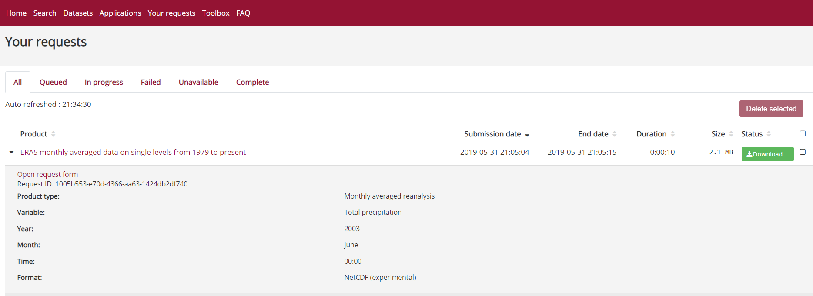
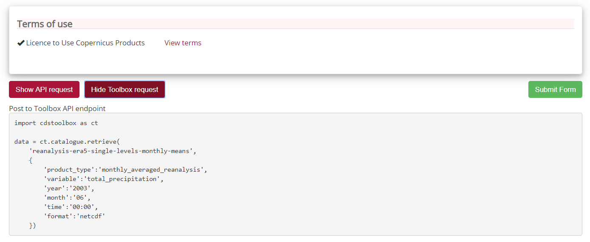
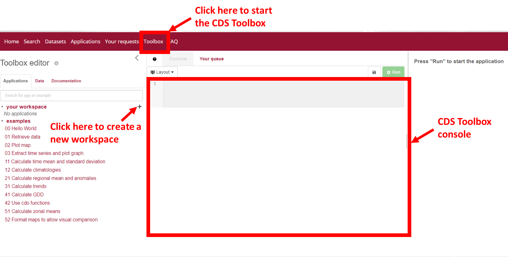
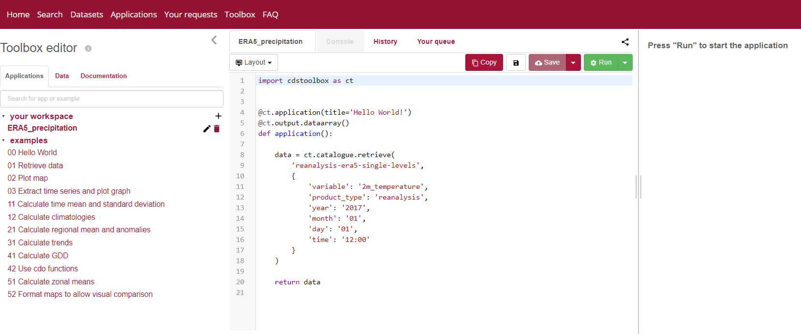

---	
title: "Climate Data Store Toolbox"	
teaching: 0	
exercises: 0	
questions:	
- "What is the Copernicus Climate Data Store Toolbox?"	
- "How to retrieve dataset with the Toolbox?"	
- "How to quickly visualize a dataset with the Toolbox?"	
- "What is the best workflow to analyze and visualize climate data?"	
objectives:	
- "Get an overview of various aspects of the CDS Toolbox"	
- "Learn how to manipulate netCDF data within the CDS Toolbox"	
keypoints:	
- "CDS Toolbox"	
- "Data retrieval from the Toolbox"	
- "Data visualization from the Toolbox"	
---	

 Let's make the same selection as before. Go to "[your requests](https://cds.climate.copernicus.eu/cdsapp#!/yourrequests?tab=form)" tab and select the last product you downloaded.	

 	

 Click on "Open request form" and you will be re-directed to the selection page with all your previous choices already pre-selected.	

 This time, instead of clicking on "Submit Form", we click on "Show Toolbox request":	

 	

 Copy the content in your clipboard so we can paste it later in the CDS Toolbox.	

 The CDS Toolbox package is still under active development and the current documentation can be found [here](https://devpi.copernicus-climate.eu//root/master/cdstoolbox/0.9.8.8/+d/index.html).	

 ~~~	
import cdstoolbox as ct	
 data = ct.catalogue.retrieve(	
     'reanalysis-era5-single-levels-monthly-means',	
     {	
         'product_type':'monthly_averaged_reanalysis',	
         'variable':'total_precipitation',	
         'year':'2003',	
         'month':'06',	
         'time':'00:00',	
         'format':'netcdf'	
     })	
~~~	
{: .python}	

 - Then click on "Toolbox" tab to start the CDS toolbox:	

 	

 - Create a new *workspace* and name it **ERA5_precipitation** (make sure you press the *enter* button to validate your choice otherwise the new workspace will not be created.	
- Finally paste your previous selection in the toolbox console:	

 	

 > ## Is it python syntax?	
> If you are a python programmer, you probably have recognized the syntax. Otherwise, it may be a bit difficult to understand!	
> The goal here is not to learn how to use the Python CDS toolbox package as it is currently not open source.	
> For now, we make our selection via the web interface and then copy paste the request.	
>	
{: .callout}	

 
 